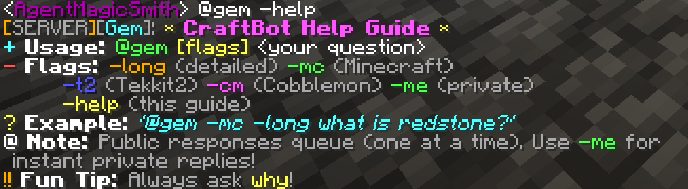

# CraftBot - Multi-Server Minecraft Chatbot

A Node.js application for a multi-server Minecraft chatbot that integrates with the Gemini API. This bot monitors multiple Minecraft server log files and responds to chat messages using Google's Gemini AI.

## Features

- **Multi-Server Support**: Monitor and respond to multiple Minecraft servers simultaneously
- **Gemini AI Integration**: Powered by Google's Gemini 1.5 Flash model for intelligent responses
- **Robust RCON Communication**: Auto-reconnecting RCON with exponential backoff for server restarts
- **Real-time Log Monitoring**: Watches server log files for new chat messages
- **Smart Message Chunking**: Automatically splits long AI responses to fit Minecraft's chat limits
- **Response Queueing**: Prevents chat spam by processing one public response at a time
- **Private Messaging**: `-me` flag for instant private responses that bypass the public queue
- **Context Flags**: Specialized responses for Minecraft, Tekkit2, and Cobblemon modpacks
- **Customizable Response Length**: Concise answers by default, detailed with `-long` flag
- **Beautiful Formatting**: Custom JSON tellraw formatting with `[SERVER][Gem]` branding
- **Systemd Service Support**: Easy deployment as a Linux system service

## Project Structure

```
CraftBot/
├── package.json                    # Project dependencies and metadata
├── .env                           # Environment variables (API keys) - create from .env.example
├── .env.example                   # Example environment variables template
├── config.json                    # Server configurations (working file) - create from config.example.json
├── config.example.json            # Example server configuration template
├── craftbot.js                    # Main application logic
├── minecraft-bot.service          # Systemd service file (working file) - create from .service.example
├── minecraft-bot.service.example  # Example systemd service template
├── test-config.js                 # Configuration validation script
├── preview.png                    # Screenshot of bot help message in Minecraft
├── .gitignore                     # Git ignore rules
├── LICENSE                        # License file
└── README.md                      # This file
```

## Prerequisites

- Node.js (v14 or higher)
- Minecraft server(s) with RCON enabled
- Google Gemini API key

## Setup Instructions

### 1. Install Dependencies

```bash
npm install
```

### 2. Configure Environment Variables

Copy the example environment file and add your Gemini API key:

```bash
cp .env.example .env
```

Edit the `.env` file with your actual API key:

```env
GEMINI_API_KEY="your_actual_gemini_api_key_here"
```

Get your API key from [Google AI Studio](https://aistudio.google.com/app/apikey).

### 3. Configure Servers

Copy the example configuration and customize it for your servers:

```bash
cp config.example.json config.json
```

Edit `config.json` to add your Minecraft servers:

```json
{
  "servers": [
    {
      "name": "Survival",
      "logPath": "/path/to/your/survival-server/logs/latest.log",
      "rconHost": "localhost",
      "rconPort": 25575,
      "rconPassword": "your_survival_rcon_password",
      "chatRegex": "\\[[^\\]]+\\] \\[Server thread\\/INFO\\](?:\\s\\[[^\\]]+\\])?: <(.+?)> (.*)"
    },
    {
      "name": "Creative",
      "logPath": "/path/to/your/creative-server/logs/latest.log",
      "rconHost": "localhost",
      "rconPort": 25585,
      "rconPassword": "your_creative_rcon_password",
      "chatRegex": "\\[[^\\]]+\\] \\[Server thread\\/INFO\\](?:\\s\\[[^\\]]+\\])?: <(.+?)> (.*)"
    }
  ]
}
```

**Configuration Options:**

- **`name`**: Friendly name for the server (used in console logs)
- **`logPath`**: Full path to the server's latest.log file
- **`rconHost`**: RCON server hostname (usually "localhost")
- **`rconPort`**: RCON port number (set in server.properties)
- **`rconPassword`**: RCON password (set in server.properties)
- **`chatRegex`**: Regular expression to match chat messages in logs (optional)

### 4. Enable RCON on Your Minecraft Servers

Add these lines to your `server.properties` file for each Minecraft server:

```properties
enable-rcon=true
rcon.port=25575
rcon.password=your_rcon_password
```

**Note**: Use different RCON ports for each server if running multiple servers on the same machine.

### 5. Test Your Configuration

Before running the bot, validate your setup:

```bash
node test-config.js
```

This will check:
- ✅ Environment variables (API key)
- ✅ Server configurations and file paths
- ✅ RCON connectivity to each server
- ✅ Gemini API connectivity
- ✅ Log file accessibility and format

## Running the Bot

### Development Mode

```bash
npm start
```

or

```bash
node craftbot.js
```

### Production Linux Systemd Service

The included systemd service provides enterprise-grade reliability with auto-start on boot, automatic restart on failure, and comprehensive logging.

#### Features
- **Auto-start on boot** - Automatically starts when the system boots
- **Self-healing** - Restarts automatically if the bot crashes
- **Resource protection** - Prevents excessive resource usage
- **Security hardening** - Runs with minimal privileges
- **Centralized logging** - All output captured in systemd journal

#### Setup Instructions

1. **Copy and customize the service file:**
   ```bash
   sudo cp minecraft-bot.service.example /etc/systemd/system/minecraft-bot.service
   ```

2. **Edit the service file to match your environment:**
   ```bash
   sudo nano /etc/systemd/system/minecraft-bot.service
   ```

   Update these fields to match your setup:
   ```ini
   User=your_user                                    # → your actual username
   Group=your_user_group                            # → your actual group  
   WorkingDirectory=/home/your_user/CraftBot        # → your actual path
   ExecStart=/usr/bin/node /home/your_user/CraftBot/craftbot.js  # → your actual path
   ```

3. **Install and start the service:**
   ```bash
   # Reload systemd configuration
   sudo systemctl daemon-reload
   
   # Enable auto-start on boot
   sudo systemctl enable minecraft-bot.service
   
   # Start the service now
   sudo systemctl start minecraft-bot.service
   ```

#### Service Management

```bash
# Check service status
sudo systemctl status minecraft-bot.service

# View live logs (follow mode)
sudo journalctl -u minecraft-bot.service -f

# View recent logs
sudo journalctl -u minecraft-bot.service --since "1 hour ago"

# Restart the service
sudo systemctl restart minecraft-bot.service

# Stop the service  
sudo systemctl stop minecraft-bot.service

# Disable auto-start
sudo systemctl disable minecraft-bot.service
```

#### Service Configuration

The systemd service includes these production-ready settings:

- **Restart Policy**: `Restart=always` with 10-second delay
- **Failure Handling**: Up to 3 restart attempts per minute before giving up
- **Network Dependencies**: Waits for network connectivity before starting
- **Security**: Private tmp directories, no privilege escalation
- **Logging**: All output directed to systemd journal with `craftbot` identifier
- **Environment**: Runs in `NODE_ENV=production` mode

## Usage

Once the bot is running and monitoring your servers, players can interact with it by typing messages that start with `@gem` in the Minecraft chat.

### Basic Usage

```
@gem What's the weather like today?
@gem How do I make a redstone clock?
@gem Tell me a joke
```

### Advanced Features & Flags

The bot supports several flags to customize responses:

#### Response Length
- **Default**: Concise 1-2 sentence responses
- **`-long`**: Detailed 4-8 sentence explanations

```
@gem -long How does redstone work?
```

#### Context-Specific Help
- **`-mc`**: Java Minecraft general context
- **`-t2`**: Tekkit2 modpack context  
- **`-cm`**: Cobblemon modpack context

```
@gem -mc How do I make a piston?
@gem -t2 What's the best power source?
@gem -cm How do I catch Pokemon?
```

#### Private Responses
- **`-me`**: Send response privately to you (bypasses public queue)

```
@gem -me -long What's the best strategy for this modpack?
```

#### Help
- **`-help`**: Show the in-game help guide

```
@gem -help
```

### Response Queueing System

**Public Responses**: The bot processes one public response at a time to prevent chat spam. If multiple players ask questions simultaneously, they will be queued and answered in order.

**Private Responses**: Using the `-me` flag sends responses directly to you via whisper/private message and bypasses the public queue for instant replies.

### Special Features

- **"Why" Questions**: Questions containing "why" get a fun "Why not?" prefix
- **Smart Chunking**: Long responses are automatically split into readable chunks
- **Beautiful Formatting**: Responses use custom JSON formatting with `[SERVER][Gem]` branding

### How It Works

The bot will:
1. Detect your message in the server logs
2. Process flags and context
3. Query the Gemini API with your question
4. Send the AI response back to Minecraft chat (public or private)
5. Queue additional public responses to prevent spam

## Configuration Options

CraftBot now features comprehensive configuration through the `config.json` file. All major settings can be customized without editing code.

### Global Configuration

The `global` section in `config.json` contains bot-wide settings:

```json
{
  "global": {
    "botTrigger": "@gem",
    "geminiModel": "gemini-1.5-flash",
    "botName": "Gem",
    "chunkSizes": {
      "headerChunk": 45,
      "continuationChunk": 60
    },
    "delays": {
      "regularResponse": 1000,
      "longResponse": 2000,
      "queueDelay": 500,
      "helpMessageDelay": 1000
    },
    "reconnect": {
      "initialInterval": 15000,
      "maxInterval": 300000
    },
    "styling": {
      "messageColor": "white",
      "headerColors": {
        "bracket": "gold",
        "serverText": "gray",
        "botName": "aqua",
        "separator": "gray"
      },
      "helpColors": {
        "title": "light_purple",
        "accent": "yellow",
        "usage": "green",
        "flags": "gold",
        "example": "aqua",
        "note": "orange",
        "tip": "gold"
      }
    },
    "messages": {
      "helpTitle": "CraftBot Help Guide",
      "usageExample": "Usage: {trigger} [flags] <your question>",
      "exampleCommand": "'{trigger} -mc -long what is redstone?'",
      "queueNote": "Public responses queue (one at a time). Use -me for instant private replies!",
      "funTip": "Always ask why!",
      "fallbackHelp": "CraftBot Help: Use {trigger} with your questions. Try -help for more info!"
    }
  }
}
```

### Visual Example - CraftBot Help Guide

Here's how the help message appears in Minecraft chat with the default styling configuration:



The screenshot above shows the colorful, multi-line help guide that players see when they type `@gem -help`. Notice how the configuration's color settings create a beautiful, easy-to-read display with:
- **Gold brackets** around `[SERVER]`
- **Aqua bot name** for `[Gem]`
- **Color-coded sections** for different types of information
- **Proper spacing and formatting** for readability

### Configuration Reference

#### Bot Behavior
- **`botTrigger`**: Command prefix to activate the bot (default: `@gem`)
- **`geminiModel`**: Which Gemini model to use (`gemini-1.5-flash`, `gemini-1.5-pro`, etc.)
- **`botName`**: Display name in chat headers and messages

#### Message Formatting
- **`chunkSizes.headerChunk`**: Max characters for first message chunk (includes header)
- **`chunkSizes.continuationChunk`**: Max characters for continuation chunks
- **`delays.regularResponse`**: Milliseconds between regular message chunks
- **`delays.longResponse`**: Milliseconds between long response chunks  
- **`delays.queueDelay`**: Milliseconds between queued responses
- **`delays.helpMessageDelay`**: Milliseconds between help message lines

#### Connection Management
- **`reconnect.initialInterval`**: Starting reconnect delay in milliseconds
- **`reconnect.maxInterval`**: Maximum reconnect delay in milliseconds

#### Visual Styling
- **`styling.messageColor`**: Color for main message content
- **`styling.headerColors`**: Colors for message headers (`[SERVER][BotName]:`)
- **`styling.helpColors`**: Colors for different parts of help messages

#### Custom Messages
- **`messages`**: Customizable text for help messages and responses
- Use `{trigger}` placeholder in messages to insert the configured bot trigger

### Per-Server Configuration

Each server in the `servers` array can have individual settings:

- **`chatRegex`**: Custom regex pattern for parsing chat messages from logs

## Troubleshooting

### Common Issues

1. **"Log file not found" error**
   - Verify the log file paths in `config.json`
   - Ensure the Minecraft servers are running and generating logs

2. **RCON connection failures**
   - Check that RCON is enabled in `server.properties`
   - Verify the RCON port and password are correct
   - Ensure the RCON ports are not blocked by firewall
   - **Note**: The bot automatically reconnects if RCON drops during server restarts/backups

3. **Server restart/backup disconnections**
   - The bot includes automatic RCON reconnection with exponential backoff
   - Starts reconnecting after 15 seconds, doubles interval up to 5 minutes
   - No manual intervention needed - it will reconnect automatically

4. **Gemini API errors**
   - Verify your API key is correct in the `.env` file
   - Check your API quota and billing status
   - Ensure you have internet connectivity

5. **Bot not responding to messages**
   - Check the console logs for error messages
   - Verify the bot trigger format (`@gem` by default)
   - Ensure the log file regex pattern matches your server's log format

### Log File Formats & Custom Regex

The bot supports configurable chat message detection per server using the `chatRegex` field in your configuration.

**Default Format** (works for most vanilla and modded servers):
```
[Server thread/INFO]: <PlayerName> message content
[Server thread/INFO] [ModName]: <PlayerName> message content
```

**Default Regex Pattern**:
```
\\[[^\\]]+\\] \\[Server thread\\/INFO\\](?:\\s\\[[^\\]]+\\])?: <(.+?)> (.*)
```

**Custom Log Formats**: If your server uses a different log format, add a custom `chatRegex` pattern to each server configuration:

```json
{
  "name": "CustomServer",
  "logPath": "/path/to/logs/latest.log",
  "rconHost": "localhost", 
  "rconPort": 25575,
  "rconPassword": "password",
  "chatRegex": "your_custom_regex_pattern_here"
}
```

**Common Alternative Patterns**:
- **Paper/Spigot**: `\\[\\d{2}:\\d{2}:\\d{2}\\] \\[Server thread\\/INFO\\]: <(.+?)> (.*)`
- **Fabric**: `\\[[^\\]]+\\] \\[ServerMain\\/INFO\\]: <(.+?)> (.*)`
- **Forge**: `\\[[^\\]]+\\] \\[Server thread\\/INFO\\] \\[[^\\]]+\\]: <(.+?)> (.*)`

**Regex Testing**: The `test-config.js` script validates your regex patterns and tests them against sample log formats.

## Security Considerations

- Keep your `.env` file secure and never commit it to version control
- Use strong RCON passwords
- Consider running the bot on a separate machine or container
- Regularly update dependencies for security patches

## License

ISC

## Author

Jacob Norr [MagicInUse](https://github.com/MagicInUse)

## Contributing

Feel free to submit issues and enhancement requests!
A Minecraft + Gemini Chatbot
